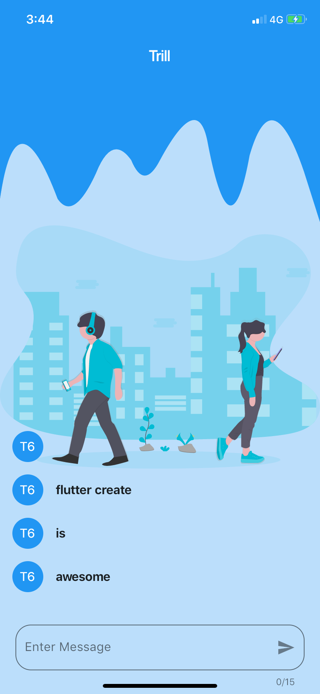
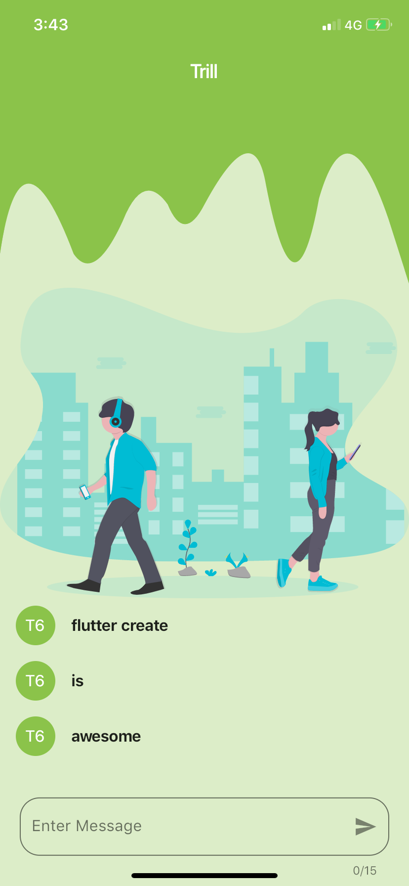

# Flutter TrillApp

TrillApp is made for flutter create contest unser 5KB of dart code. The purpose of the app is to share the data between devices offline using sound. Suppose, you are boarding a shuttle/bus/train, how easy it will be for you and the driver to hop you on using sound without internet on as single click.

There can be many use cases where you want to send some bytes of data but don't have any internet connection. So, Trill App is for you. It doesn't require any internet. For the purpose of explaining it, I have made this chat app where you can send some bytes of message using sound to other nearby devices.

- The App is running on both android & iOS real devices when I tested. Make sure to give microphone permission when it asks for it.

### Screenshots

 

### Created & Maintained By

[Pawan Kumar](https://github.com/iampawan) ([@imthepk](https://www.twitter.com/imthepk)) ([Youtube](https://www.youtube.com/c/MTechViral))
([Insta](https://www.instagram.com/codepur_ka_superhero))

# License

    Copyright 2019 Pawan Kumar

    Licensed under the Apache License, Version 2.0 (the "License");
    you may not use this file except in compliance with the License.
    You may obtain a copy of the License at

       http://www.apache.org/licenses/LICENSE-2.0

    Unless required by applicable law or agreed to in writing, software
    distributed under the License is distributed on an "AS IS" BASIS,
    WITHOUT WARRANTIES OR CONDITIONS OF ANY KIND, either express or implied.
    See the License for the specific language governing permissions and
    limitations under the License.

## Getting Started

For help getting started with Flutter, view our online
[documentation](https://flutter.dev/).
